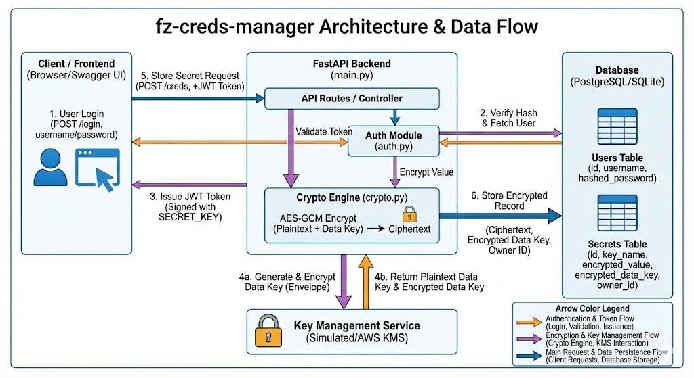

# Infrastructure and Application bundle

## Infrastructure Architecture & Monitoring
This project is/can deployed on a highly available and scalable infrastructure using Amazon EKS (Elastic Kubernetes Service). The observability stack is built on Prometheus and Grafana to provide real-time insights into cluster health and application performance.

### 🛠 Infrastructure Components
1. Networking Layer (AWS VPC)
    - Public Subnets: House the AWS Application Load Balancer (ALB) and Internet Gateway to manage external traffic.
    -    Private Subnets: Where the EKS Worker Nodes and application pods reside. This ensures that the core compute resources are not directly exposed to the public internet.
    - AWS ALB Ingress Controller: Automatically manages the lifecycle of the AWS Load Balancer, routing external traffic to the internal Grafana and Application services.

2. Compute Layer (Amazon EKS)
    - Control Plane: Managed by AWS, ensuring high availability of the Kubernetes API.
    - Worker Nodes: EC2 instances (typically managed node groups) running the fz-creds-manager and the monitoring stack.

    - Namespaces: * default: Primary workspace for the application.

    - monitoring: Isolated namespace for Prometheus and Grafana.

### 📊 Monitoring & Observability Stack

We utilize a "Pull-based" metric architecture to monitor the cluster.

1. Prometheus (The Metrics Engine)
    - Role: Acts as the time-series database.

    - Scraping: Prometheus periodically "scrapes" metrics from application pods and node exporters.
    - Internal Service: A Kubernetes Service (ClusterIP) provides a static internal endpoint for Grafana to query metrics reliably.

2. Grafana (The Visualization Layer)
    - Role: The dashboarding interface for the team.

    - Data Source: Connected to the Prometheus internal service.

    - Access: Exposed via the AWS Load Balancer on Port 80/443, allowing team members to access dashboards securely from their browsers.

---
---
---
## Application architecture for 'fz-creds-manager' app
A secure, local key-value store using Envelope Encryption (AES-256-GCM) and OAuth2 Authentication.
Built with Python (FastAPI), SQLAlchemy, and Cryptography.

---
### Security Notice

This is a demonstration of security architecture patterns. 
While it uses industry-standard libraries (cryptography, passlib), 
please review the code thoroughly before using it for production secrets.

---
### Setup
1. `pip install -r requirements.txt`
2. Copy `.env.example` to `.env` and generate your own keys.
3. Run `uvicorn main:app --reload`

#### Note: `The MASTER_KEY should be handled with care and that this is a "Proof of Concept" before moving to AWS.`

#### To use AWS KMS:
1. Create IAM user (add necessary permissions to access KMS)
2. Go to the KMS Console -> Customer managed keys (add necessary permissions under Key Policy for user to access)

#### Note: `AWS KMS keys have a "double-lock." The user needs permission to use the key, and the Key itself must allow that user.` 

---
### Architecture:

---
#### Stacks with reason for selecting:
- Backend API - FastAPI (Speed and documentation)
- Hashing - Argon2 (GPU resistance - secure from brute force attack)
- Encryption - AES-GCM	(modern, faster, and safer standard)
- Authentication - JWT (Scalability)
- Database - SQLAlchemy (Security & Readability)

---
License:
MIT License